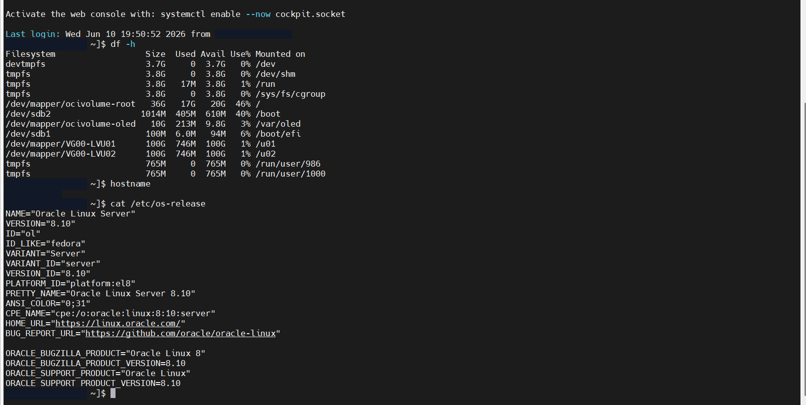
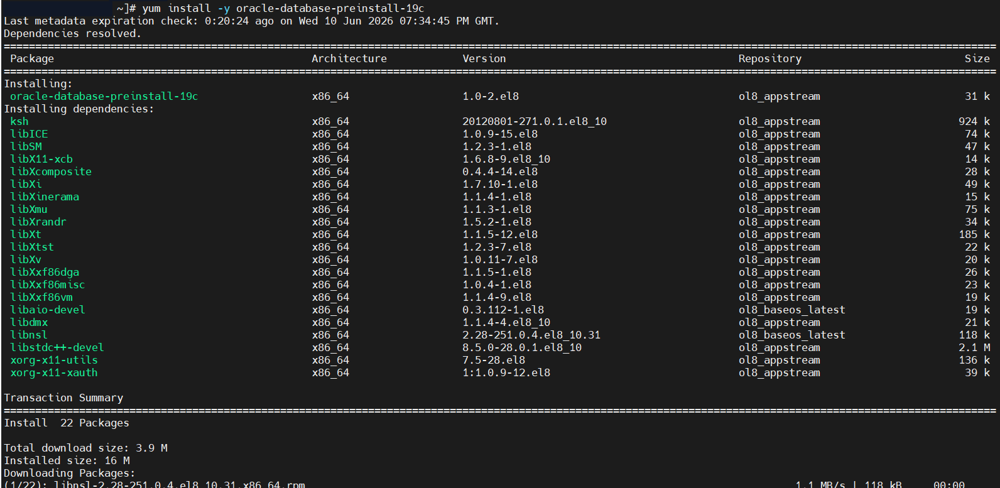
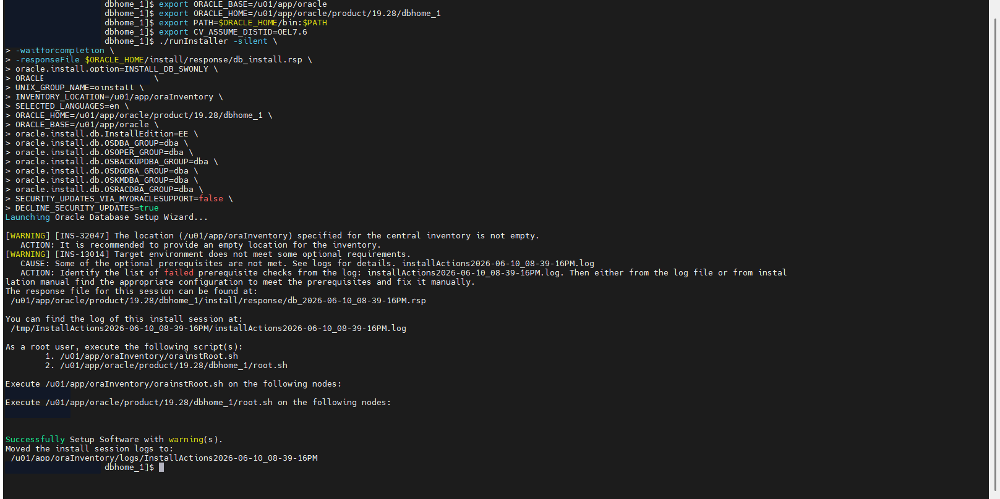
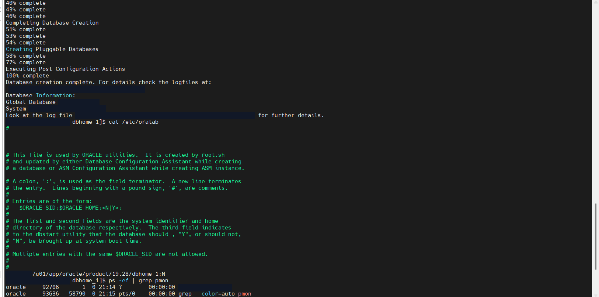
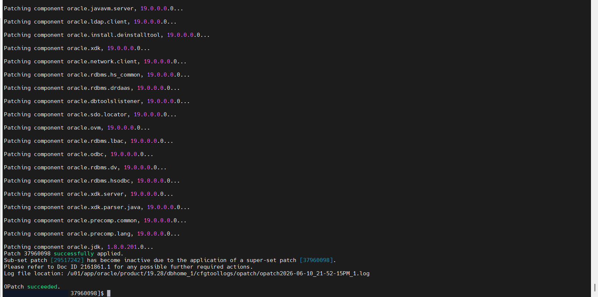
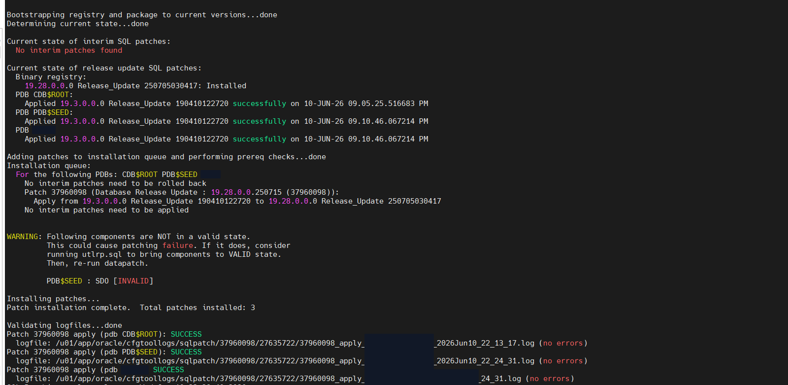
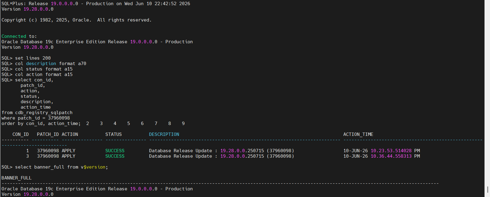

# Implantação e atualização do Oracle Database 19c Multitenant

## Visão geral

Este projeto documenta a implantação do Oracle Database 19c em Oracle Linux, a criação de uma arquitetura Multitenant com CDB/PDB e a aplicação de um Release Update com OPatch e datapatch.

## Objetivo

Demonstrar um fluxo reproduzível para:

- validar o sistema operacional e o armazenamento;
- preparar os pré-requisitos do Oracle Database 19c;
- instalar o software em modo silencioso;
- criar e validar uma CDB com PDB;
- atualizar o Oracle Home com um Release Update;
- aplicar as alterações SQL com datapatch;
- confirmar a versão e o registro do patch nos containers.

## Tecnologias utilizadas

- Oracle Database 19c Enterprise Edition
- Oracle Multitenant (CDB/PDB)
- Oracle Database Configuration Assistant (DBCA)
- OPatch e datapatch
- SQL*Plus
- Oracle Linux 8
- Shell

## Arquitetura e fluxo


## Estrutura do repositório

```text
.
├── README.md
├── .gitignore
├── docs/
│   └── procedure.md
├── images/
│   ├── 01-os-and-storage-validation.png
│   ├── 02-oracle-preinstall-package.png
│   ├── 03-silent-software-installation.png
│   ├── 04-multitenant-database-created.png
│   ├── 05-release-update-applied.png
│   ├── 06-datapatch-completed.png
│   └── 07-release-update-validation.png
├── scripts/
│   └── shell/
│       └── install-software.example.sh
└── sql/
    └── validate-release-update.sql
```

## Procedimento executado

1. Validação dos filesystems e da versão do Oracle Linux.
2. Instalação do pacote `oracle-database-preinstall-19c`.
3. Preparação do Oracle Base, Oracle Home, inventário, área de dados, stage e área de recuperação.
4. Instalação silenciosa do software com `runInstaller`.
5. Execução dos scripts de root solicitados pelo instalador.
6. Criação silenciosa da CDB e da PDB com DBCA.
7. Validação da instância, dos containers e do estado da PDB.
8. Atualização do OPatch.
9. Aplicação do Release Update ao Oracle Home.
10. Inicialização do banco e execução do datapatch.
11. Validação do patch em `CDB_REGISTRY_SQLPATCH` e da versão em `V$VERSION`.

O [procedimento detalhado](docs/procedure.md) relaciona cada etapa às evidências disponíveis.

## Principais comandos

Validação inicial:

```bash
df -h
hostname
cat /etc/os-release
```

Pré-requisito:

```bash
yum install -y oracle-database-preinstall-19c
```

Validação dos containers:

```sql
SHOW PDBS;
SELECT banner_full FROM v$version;
```

O exemplo de instalação em [`scripts/shell/install-software.example.sh`](scripts/shell/install-software.example.sh) utiliza variáveis fictícias.

## Validação

As evidências registram:

- conclusão da instalação do software, com avisos;
- conclusão da criação do banco;
- presença do processo PMON;
- CDB/PDB abertas após a atualização;
- aplicação do Release Update pelo OPatch;
- conclusão do datapatch;
- status `SUCCESS` no registro SQL do patch;
- versão final 19.28 do Oracle Database.

## Problemas encontrados

### Ausência de DISPLAY

O instalador gráfico e o DBCA não puderam iniciar porque a sessão não possuía uma variável `DISPLAY` válida.

### Avisos de pré-requisitos

A instalação silenciosa registrou os avisos `INS-32047` e `INS-13014`, relacionados ao inventário central e a requisitos opcionais.

### Componente inválido durante o datapatch

O datapatch indicou um componente SDO inválido na PDB seed e recomendou a recompilação com `utlrp.sql` caso isso provocasse falha. A evidência mostra a conclusão do patch, mas não comprova uma execução posterior do `utlrp.sql`.

## Soluções aplicadas

- substituição do fluxo gráfico pela instalação silenciosa;
- uso do DBCA em modo silencioso;
- atualização do OPatch antes da aplicação do Release Update;
- execução do datapatch após a atualização binária;
- validação no dicionário de dados e em `V$VERSION`.

## Resultados

- Oracle Database 19c instalado e validado;
- arquitetura Multitenant criada e aberta;
- Release Update aplicado ao Oracle Home;
- alterações SQL aplicadas nos containers;
- versão 19.28 confirmada nas evidências.

## Evidências

### Sistema operacional e armazenamento



### Instalação do pacote de pré-requisitos



### Instalação silenciosa



### Criação do ambiente Multitenant



### Aplicação do Release Update



### Execução do datapatch



### Validação final



## Boas práticas aplicadas

- separação entre software, dados, stage, recuperação e backup;
- instalação silenciosa documentada;
- preservação da arquitetura Multitenant durante a atualização;
- parada controlada do banco antes do patch binário;
- execução do datapatch após a atualização do Oracle Home;
- validação do resultado no dicionário de dados;

## Aprendizados demonstrados

- preparação de Oracle Linux para Oracle Database;
- instalação automatizável do Oracle 19c;
- administração de CDB/PDB;
- atualização do Oracle Home;
- diagnóstico de avisos de instalação e patch;
- validação técnica de uma atualização.

## Autor

Patrick Cecílio

GitHub: [PatrickCecilio](https://github.com/PatrickCecilio)

LinkedIn: a adicionar

## English summary

This repository documents an Oracle Database 19c Multitenant deployment on Oracle Linux, including silent software installation, CDB/PDB creation, Release Update application with OPatch and datapatch, and final validation. All screenshots and examples were sanitized before publication.
