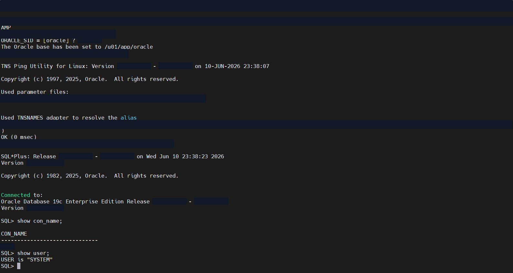
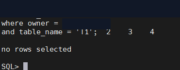
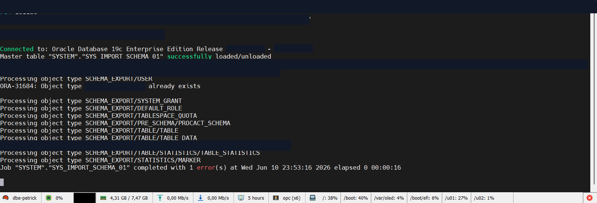
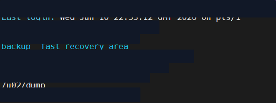
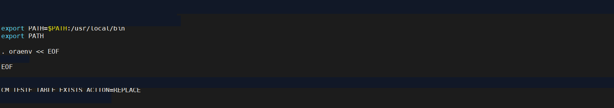

# Migração de schema com Oracle Data Pump

Case técnico de migração lógica de um schema Oracle com `expdp` e `impdp`. O procedimento abrange a preparação do destino, configuração do diretório do Data Pump, validação de conectividade, exportação, importação, tratamento de uma ocorrência conhecida e conferência objetiva da quantidade de registros.

## Resumo executivo

| Item | Descrição |
|---|---|
| Plataforma | Oracle Database 19c Enterprise Edition em Linux |
| Escopo | Migração lógica de schema |
| Ferramentas | Data Pump Export (`expdp`), Data Pump Import (`impdp`), SQL\*Plus, TNSPING e shell |
| Diretório físico | `/u02/dump` |
| Volume exportado | 55.410 registros e 7,511 MB de dados de tabela |
| Política para tabelas existentes | `TABLE_EXISTS_ACTION=REPLACE` |
| Ocorrência na importação | `ORA-31684` para usuário previamente criado no destino |
| Resultado | Tabela criada no destino e contagem final de 55.410 registros |

## Cenário

O objetivo era transportar um schema para um ambiente Oracle 19c por meio de um dump lógico. O destino foi preparado previamente com usuário, privilégios, tablespace e diretório do Data Pump. Essa preparação permitiu controlar a estrutura de destino antes da carga, mas fez com que a importação encontrasse um usuário já existente.

## Objetivos

- preparar o schema de destino e seus privilégios;
- disponibilizar um diretório físico para os arquivos do Data Pump;
- validar a resolução do serviço e a conexão com o container correto;
- exportar objetos, metadados e dados do schema de origem;
- importar o dump com substituição controlada de tabelas existentes;
- analisar ocorrências do job de importação;
- confirmar a presença da tabela e a quantidade de registros no destino.

## Fluxo da migração


## 1. Preparação do destino

O usuário de destino foi criado com tablespace padrão e temporário. Em seguida, foram concedidos os privilégios necessários para receber os objetos do schema, incluindo a criação de procedimentos.

```sql
CREATE USER <target_schema>
  IDENTIFIED BY <password>
  DEFAULT TABLESPACE <default_tablespace>
  TEMPORARY TABLESPACE TEMP;

GRANT CREATE SESSION TO <target_schema>;
GRANT CREATE TABLE TO <target_schema>;
GRANT CREATE PROCEDURE TO <target_schema>;
```


## 2. Diretório do Data Pump

O objeto `DIRECTORY` foi associado ao caminho `/u02/dump`. Os privilégios de leitura e escrita foram concedidos aos usuários envolvidos, e o caminho físico foi conferido no sistema operacional.

```sql
CREATE DIRECTORY <data_pump_directory> AS '/u02/dump';
GRANT READ, WRITE ON DIRECTORY <data_pump_directory> TO SYSTEM;
GRANT READ, WRITE ON DIRECTORY <data_pump_directory> TO <target_schema>;

SELECT directory_name, directory_path
FROM dba_directories
WHERE directory_name = '<DATA_PUMP_DIRECTORY>';
```


## 3. Validação de conectividade

Antes da movimentação dos dados, o alias TNS foi validado com retorno `OK`. A conexão pelo SQL\*Plus confirmou o Oracle Database 19c, o container selecionado e o usuário administrativo utilizado na operação.

```bash
tnsping <target_service>
sqlplus system@<target_service>
```

```sql
SHOW CON_NAME;
SHOW USER;
```



## 4. Exportação do schema

O ambiente Oracle foi carregado no shell com `oraenv` e a exportação foi executada por um script dedicado. O job processou metadados do usuário, grants, roles, quota, tabelas, dados e estatísticas.

Estrutura equivalente dos parâmetros utilizados:

```bash
expdp system@<source_service> \
  schemas=<source_schema> \
  directory=<data_pump_directory> \
  dumpfile=<dump_file>.dmp \
  logfile=<export_log>.log
```

O `SYS_EXPORT_SCHEMA_01` terminou com sucesso em 29 segundos. A tabela apresentada nas evidências exportou 55.410 registros, correspondentes a 7,511 MB.


## 5. Verificação pré-importação

Uma consulta ao catálogo confirmou que a tabela usada como referência de validação ainda não existia no destino. Esse ponto de controle fornece uma linha de base clara para comparar o estado anterior e posterior à importação.

```sql
SELECT owner, table_name
FROM dba_tables
WHERE owner = '<TARGET_SCHEMA>'
  AND table_name = '<REFERENCE_TABLE>';
```



## 6. Importação no destino

O script de importação carregou o ambiente Oracle e executou o `impdp` com substituição das tabelas existentes.

```bash
impdp system@<target_service> \
  schemas=<source_schema> \
  directory=<data_pump_directory> \
  dumpfile=<dump_file>.dmp \
  logfile=<import_log>.log \
  table_exists_action=replace
```

Durante o job, o Data Pump processou usuário, grants, roles, quotas, tabelas, dados e estatísticas.

## 7. Ocorrência analisada: ORA-31684

A importação terminou com uma ocorrência:

```text
ORA-31684: Object type USER already exists
```

O usuário já havia sido criado intencionalmente durante a preparação do destino. Por isso, o Data Pump não conseguiu recriar esse objeto específico, mas prosseguiu com os demais metadados e com a carga dos dados.

Para tornar uma nova execução mais limpa quando o usuário continuar sendo provisionado previamente, o job pode excluir apenas a criação do usuário:

```text
EXCLUDE=USER
```

Essa decisão deve ser combinada com a manutenção explícita dos privilégios, quotas e tablespaces necessários no destino.



## 8. Validação pós-importação

A validação final confirmou que a tabela passou a existir sob o schema esperado e que continha exatamente 55.410 registros, a mesma quantidade registrada durante a exportação.

```sql
SELECT owner, table_name
FROM dba_tables
WHERE owner = '<TARGET_SCHEMA>'
  AND table_name = '<REFERENCE_TABLE>';

SELECT COUNT(*) AS total_registros
FROM <target_schema>.<reference_table>;
```


## Resultado

A migração lógica foi concluída com correspondência quantitativa entre a exportação e o destino: 55.410 registros. A tabela inexistente antes da carga foi identificada no catálogo após o `impdp`, e os dados ficaram disponíveis para consulta. A única ocorrência registrada, `ORA-31684`, foi explicada pela criação prévia do usuário e não impediu o processamento da tabela e de seus dados.

## Competências demonstradas

- preparação de schemas, tablespaces e privilégios;
- configuração e validação de Oracle Directory;
- diagnóstico de conectividade com TNSPING e SQL\*Plus;
- automação de ambiente Oracle com `oraenv` e shell;
- exportação e importação de schemas com Data Pump;
- uso controlado de `TABLE_EXISTS_ACTION=REPLACE`;
- análise de logs e tratamento de `ORA-31684`;
- validação antes e depois da migração;
- reconciliação quantitativa dos dados migrados.

## Galeria completa de evidências

<details>
<summary>Exibir as 11 evidências do procedimento</summary>

### Preparação

1. Criação do usuário de destino e concessão de privilégios.

   

2. Criação do Oracle Directory, concessão de acesso e consulta no catálogo.

   

3. Verificação do caminho físico `/u02/dump` no sistema operacional.

   

### Exportação

4. Preparação do script de exportação e carregamento do ambiente Oracle.

   

5. Teste do alias TNS e confirmação da conexão no container esperado.

   

6. Exportação concluída com 55.410 registros.

   

7. Acompanhamento do processo de exportação executado em segundo plano.

   

### Importação e validação

8. Preparação do script de importação com `TABLE_EXISTS_ACTION=REPLACE`.

   

9. Linha de base antes da importação: tabela não encontrada no destino.

   

10. Tabela presente e 55.410 registros após a importação.

    

11. Log do `impdp` com processamento dos objetos e ocorrência `ORA-31684`.

    

</details>

---

[Voltar ao índice de projetos Oracle](../README.md)
