# Recuperação de desastre com Oracle RMAN

Case técnico de restauração e recuperação de um ambiente Oracle Database 19c Multitenant a partir de backups em disco. O procedimento parte de uma instância indisponível, recompõe os componentes necessários para a inicialização e termina com a validação da CDB, da PDB, do SPFILE e dos serviços registrados no listener.

## Resumo executivo

| Item | Descrição |
|---|---|
| Plataforma | Oracle Database 19c Enterprise Edition em Linux |
| Arquitetura | Oracle Multitenant com CDB e PDB |
| Ferramentas | RMAN, SQL\*Plus e LSNRCTL |
| Fonte de recuperação | Backup sets, control file e archived logs em disco |
| Condição inicial | Instância ociosa e falha de inicialização por arquivo de parâmetros indisponível |
| Estratégia | Restaurar o control file, catalogar e validar os backups, restaurar os datafiles, aplicar a recuperação e abrir o banco com `RESETLOGS` |
| Resultado | Banco aberto, PDB operacional, SPFILE persistente e serviços disponíveis no listener |

## Cenário

O listener estava ativo, mas não havia processo PMON da instância. A conexão local pelo SQL\*Plus chegava a uma instância ociosa e o comando `STARTUP` falhava com:

```text
ORA-01078: failure in processing system parameters
LRM-00109: could not open parameter file
```

Esse estado impedia a abertura normal do banco e exigia a reconstrução controlada da instância a partir dos arquivos de recuperação disponíveis.


## Objetivo

- iniciar a instância no estado mínimo necessário para o RMAN;
- restaurar e montar o control file;
- registrar e validar os backup pieces e archived logs disponíveis;
- restaurar os datafiles e aplicar a recuperação de mídia;
- abrir o banco após a recuperação;
- validar a arquitetura Multitenant e a persistência da configuração.

## Estratégia de recuperação


### 1. Diagnóstico

Foram verificados o listener, os processos da instância, a conexão local e os arquivos disponíveis. O diagnóstico confirmou que a instância não estava em execução e que a inicialização convencional não encontrava o arquivo de parâmetros esperado.

### 2. Inicialização em NOMOUNT

A instância foi iniciada em `NOMOUNT`, permitindo ao RMAN trabalhar sem que o control file estivesse montado.

```sql
STARTUP NOMOUNT;
```

### 3. Restauração do control file

O control file foi restaurado por um canal de disco. Em seguida, o banco foi montado para disponibilizar ao RMAN a estrutura física registrada no control file.

```rman
RESTORE CONTROLFILE FROM '<backup_piece>';
ALTER DATABASE MOUNT;
```


### 4. Catalogação e validação dos backups

Os diretórios de recuperação foram catalogados e o repositório RMAN foi sincronizado com os arquivos encontrados. O `CROSSCHECK` confirmou 17 objetos de backup disponíveis e validou 7 archived logs.

```rman
CATALOG START WITH '<backup_directory>' NOPROMPT;
CROSSCHECK BACKUP;
CROSSCHECK ARCHIVELOG ALL;
LIST BACKUP SUMMARY;
```


### 5. Restauração dos datafiles

O `RESTORE DATABASE` recompôs os datafiles a partir dos backup sets catalogados. A saída registra a leitura dos backup pieces e a conclusão das etapas de restauração pelo canal `ORA_DISK_1`.

```rman
RESTORE DATABASE;
```

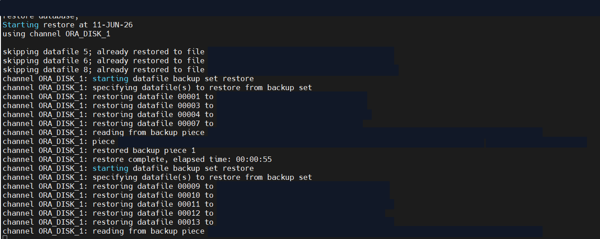

### 6. Recuperação de mídia

O `RECOVER DATABASE` aplicou os incrementais e archived logs necessários para avançar os datafiles até um ponto consistente.

```rman
RECOVER DATABASE;
```

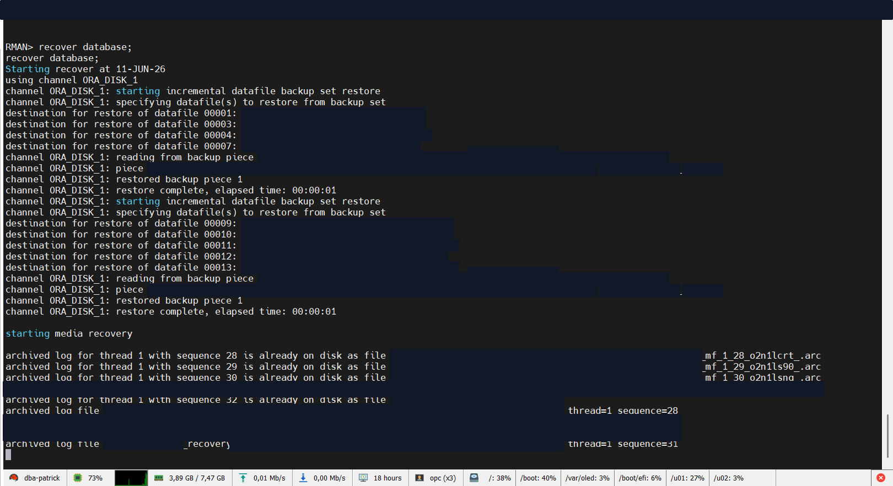

### 7. Abertura e persistência da configuração

Após a recuperação, o banco foi aberto com `RESETLOGS`. A configuração persistente da instância foi confirmada por meio do parâmetro `SPFILE`, seguida de um ciclo controlado de desligamento e inicialização.

```rman
ALTER DATABASE OPEN RESETLOGS;
```

```sql
SHOW PARAMETER SPFILE;
SHUTDOWN IMMEDIATE;
STARTUP;
```

### 8. Validação pós-recuperação

A validação confirmou:

- `PDB$SEED` aberta em `READ ONLY`;
- PDB da aplicação aberta em `READ WRITE` e sem modo restrito;
- instância reiniciada usando SPFILE;
- parâmetro `CONTROL_FILES` resolvido;
- serviços do banco registrados com status `READY` no listener;
- processo PMON ativo.

```sql
SHOW PDBS;
SHOW PARAMETER SPFILE;
SHOW PARAMETER CONTROL_FILES;
```


## Resultado

O ambiente saiu de uma instância incapaz de localizar seu arquivo de parâmetros para uma base Oracle 19c novamente montada, restaurada, recuperada e aberta. O ciclo posterior de `SHUTDOWN IMMEDIATE` e `STARTUP`, a consulta das PDBs e a verificação do listener demonstram que a recuperação não se limitou ao primeiro `OPEN`: a configuração permaneceu utilizável após a reinicialização.

## Competências demonstradas

- diagnóstico de indisponibilidade de instância Oracle;
- recuperação em estados `NOMOUNT` e `MOUNT`;
- restauração de control file e datafiles com RMAN;
- catalogação e reconciliação de backup pieces;
- validação de backups e archived logs com `CROSSCHECK`;
- recuperação de mídia e abertura com `RESETLOGS`;
- validação pós-recuperação em arquitetura Multitenant;
- verificação integrada de SQL\*Plus, RMAN, SPFILE e listener.

## Galeria completa de evidências

<details>
<summary>Exibir as 24 evidências do procedimento</summary>

### Diagnóstico e preparação

1. Listener ativo, ausência da instância e conexão local.

   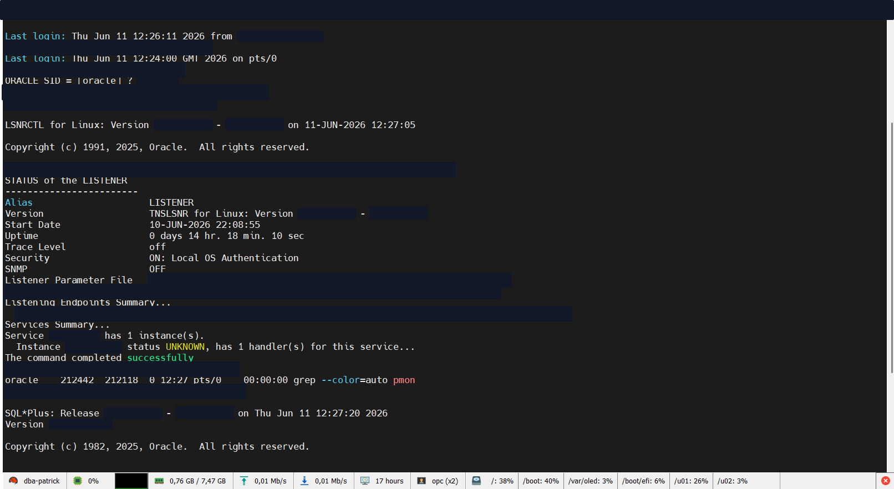

2. Falha do `STARTUP` por indisponibilidade do arquivo de parâmetros.

   

3. Verificação dos arquivos de inicialização disponíveis.

   

4. Inicialização baseada na configuração disponível e inspeção dos parâmetros.

   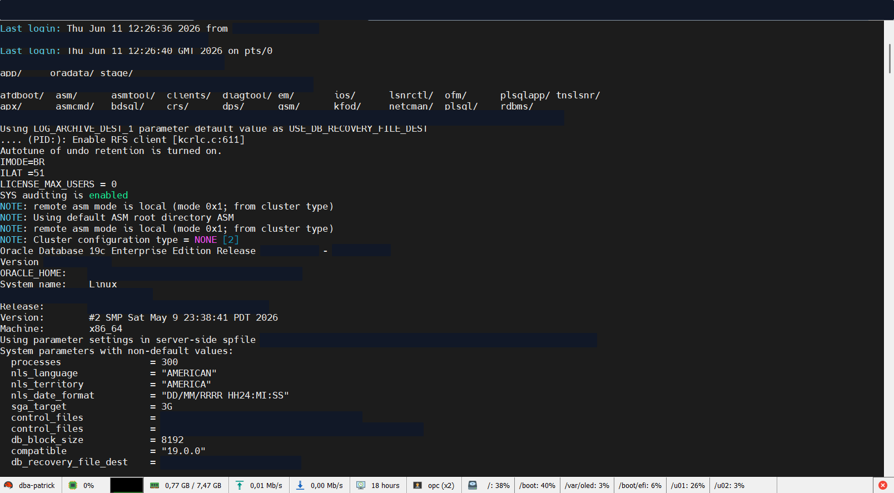

5. Verificação dos datafiles, da área de recuperação e dos backup pieces.

   

6. Instância iniciada em `NOMOUNT`.

   

### Control file e catálogo RMAN

7. Restauração do control file.

   

8. Montagem do banco.

   

9. Catalogação dos arquivos encontrados nas áreas de recuperação.

   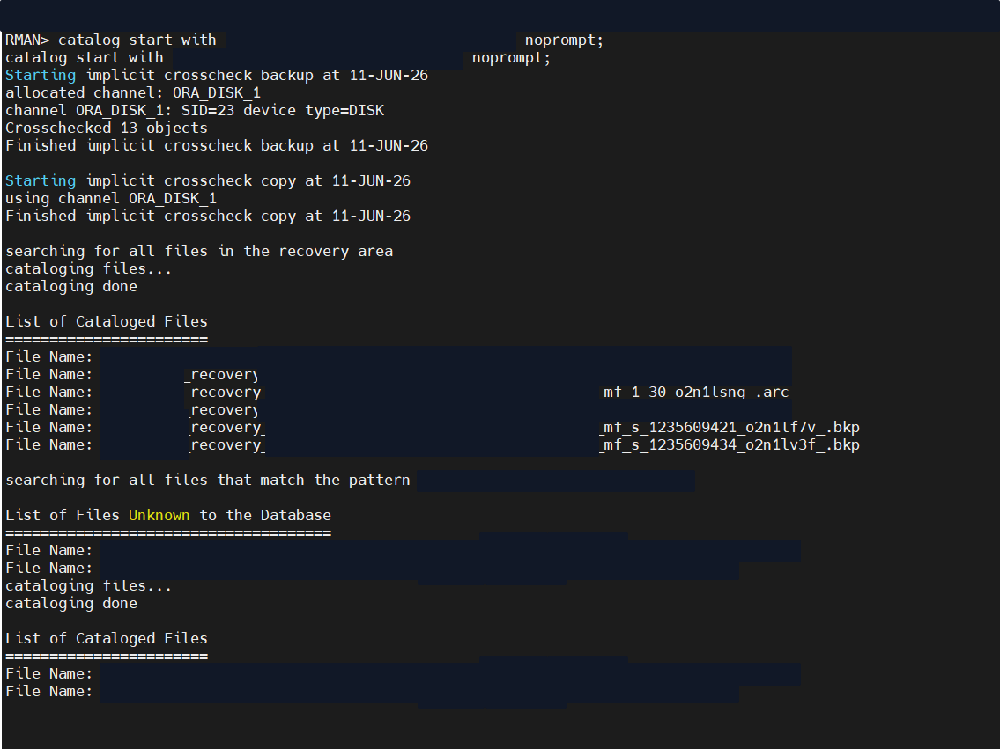

10. Confirmação de que não restaram arquivos desconhecidos no caminho consultado.

    

11. Crosscheck dos backup pieces.

    

12. Crosscheck dos archived logs.

    

13. Resumo dos backups registrados.

    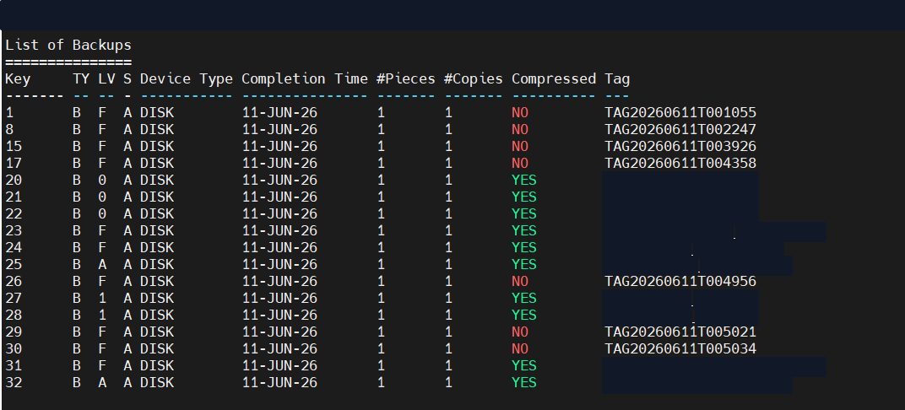

14. Relação dos archived logs disponíveis.

    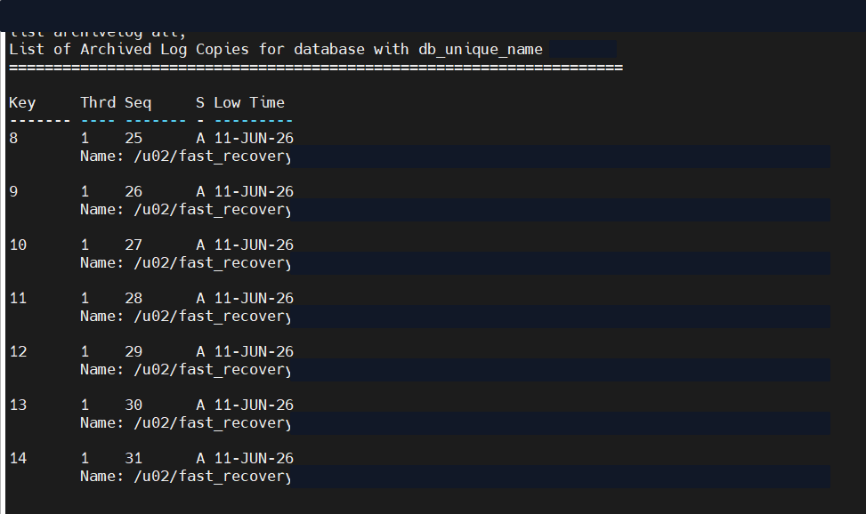

### Restauração e recuperação

15. Restauração dos datafiles.

    

16. Recuperação dos datafiles e aplicação dos archived logs.

    

17. Abertura do banco com `RESETLOGS`.

    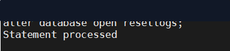

### Validação pós-recuperação

18. Validação dos modos de abertura da CDB e da PDB.

    

19. Criação do arquivo de configuração persistente.

    

20. Verificação dos arquivos de inicialização.

    

21. Desligamento controlado da instância.

    

22. Reinicialização, validação das PDBs e confirmação do SPFILE.

    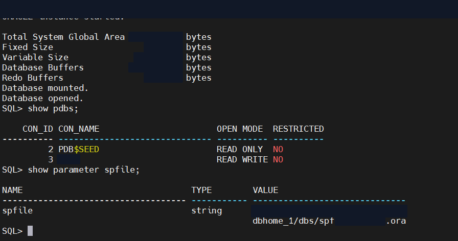

23. Serviços registrados no listener e processo PMON ativo.

    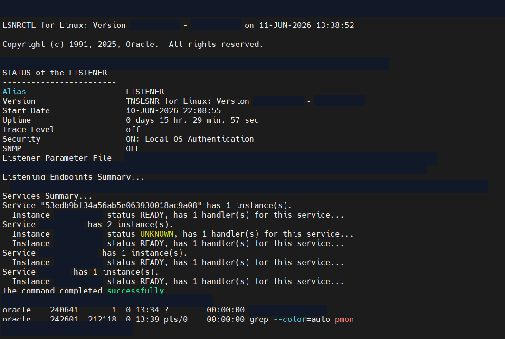

24. Confirmação do parâmetro `CONTROL_FILES`.

    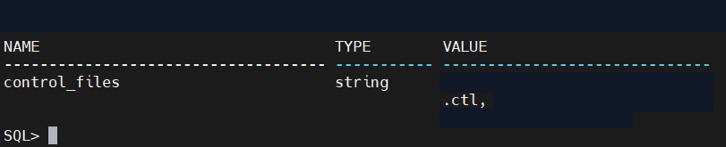

</details>

---

[Voltar ao índice de projetos Oracle](../README.md)
